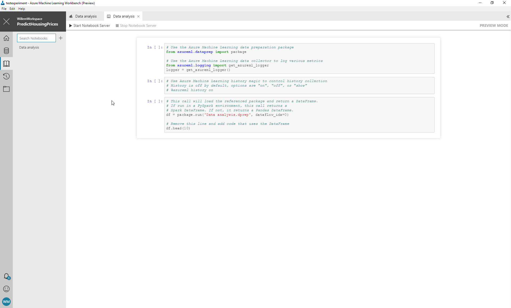
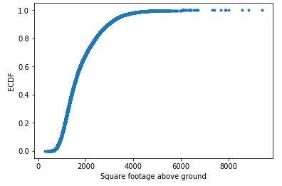

# Challenge 2: Explore the data
In the [previous challenge](../challenge-1/README.md) we loaded a housing
prices dataset into the machine learning workbench. We also looked at the 
data quality and cleaned up a few things in the dataset.

You should now have an idea of the data you have available for your house
price prediction model. Let's move on to exploratory data analysis.

Exploratory data analysis is the process of using statistics, plots and
other techniques to get a sense of the data.

Although exploratory data analysis doesn't give you the whole story, it is 
a necessary step towards building any type of model based on data. Luckely, 
performing data analysis is a pretty cheap way to verify that you have the
right data for your model.

## Step 1: Create a notebook for data analysis
Let's take a look, first open the data preparation package we created earlier.
Select the data tab in the workbench application and select the `Data Analysis`
package in the list of data preparation packages.

The package looks to be complete, so let's create a notebook for it.
Right click the package in the list on the left side of the screen. Select
the menu option `Explore using notebooks`.

This will open up a notebook in the notebooks tab of the workbench.

Click the `Start Notebook Server` button to open up the notebook in edit mode.



**Note** After starting the notebook server you may get a warning 
about the kernel that the server uses. 
When this happens, select the `PredictHousingPrices local` kernel. 

## Step 2: Load the data inside the notebook
Once started you can get to work in the python notebook. 
A python notebook is a webpage in which you can mix blocks of python code with
blocks of markdown. This is a useful method to explore the dataset. 

In a python notebook you can execute code to create dataplots and then
add markdown to document them. This will help you explain how you and why
you made certain choices. It is also useful for your teammates, they will
now exactly how to analyse the data themselves.

Initially your notebook will contain three blocks of code:

 * A block that imports a number of python packages for Azure ML workbench
 * A block that enables history recording within the workbench
 * A block that loads the dataset using the data preparation package

Execute all  blocks by selecting them and pressing Ctrl+Enter.

**Tip** Click the button with the keyboard icon for an overview of all the 
shortcuts in the notebook. Review them, you will be spending quite a bit of
time in the notebook so it is worth it to try and use the shortcuts.

The notebook will print the first 10 records of the dataset in a neat HTML table
which as you may notice, contains the same things as you saw in the preparation
screen.

Before we move on to more data analysis, it is important to get some terminology
strait:

* A row in a table is called an observation in data analysis
* A column in a table is called a feature in data analysis

It is important to keep this in mind as we move on. I will be referring to
observations and features a lot!

## Step 3: Explore some interesting correlations
The ultimate goal of today is to come up with a model that predicts the price
of a home based on the features of that home.

Let's explore some possible candidates for features of our model. 
The first one I'd like to explore with you is the square footage of a home
and its influence on the price of a home.

Add a new python block to the notebook and paste in the following code:

**Tip** Use the shortcut key <kbd>B</kbd> to add another block to your notebook. You can
convert the new block to python using the shortcut key <kbd>Y</kbd>. 
The shortcut key <kbd>Esc</kbd> takes you out of edit mode in any cell.

```
import matplotlib.pyplot as plt
```

This imports the package that enables plotting of data in charts.
From the library `matplotlib` we import the module `pyplot` and give it the
alias `plt` for easy access.

Add another block with the following code:

```
%matplotlib inline
```

This is a magic string that tells the notebook to render all plots in the HTML
rather than a separate window. The rendered plot is saved with the HTML, so
other people don't need to execute the code in the notebook to get the results.

Finally add the following block of code to render a scatter plot of the 
square footage above ground `sqft_above` compared to the `price` of a home.

```
df.plot.scatter('sqft_above', 'price')
plt.xlabel('Square footage above ground')
plt.ylabel('Price')
plt.show()
```

**Note** Notice how I asked you to put bits of code in different blocks. You 
could of course write down a large block instead. This might seem easier, 
but as you keep working this will present you with a number of problems.

You can only execute one block at a time. A large block with slow code will 
slow you down in your thought process. Small mistakes require you to reload
large chunks of data that take a lot of time. Also, this will eat up all the
memory in your system.

So, write small blocks, it will help you move faster in the long run!

### Objective: Is there a correlation?
As any good data scientists knows, when you want to
use a certain feature in a model, it is important to check for a number of 
things

In the chart, is there any correlation between `sqft_above` and `price`? 
Essentially, can you draw a line using a rule through the data that represents
the general direction in which the data is flowing? 
(hint: bottom left to top right)

There's something weird with the plot, the right side seems to be rather 
spread out, if you were to draw the line through the data, does it really form 
a good representation for all data points?

What would be a good way to handle these outliers?

### Objective: Check other dimensions
With the plotting code you used to plot the correlation between `sqft_above` and
`price` you can explore other dimensions. Try to see if
there's any useful correlation the following features and `price`:

* bedrooms
* bathrooms
* sqft_basement
* grade

Notice how the patterns between various plots vary? What does this tell you
about features like the number of bathrooms and their usefulness for predicting
the price of a home?

### Bonus objective: The year a home was renovated
There's a feature in the dataset `yr_renovated`, it doesn't have a whole lot
of observations with values above zero. Try to plot a scatter plot.

Is this a useful feature?

## Step 4: Check for outliers
In the previous step we discovered some interesting features to base our model
on. Now we need to check for other problems: outliers.

Machine learning models are a weird bunch. A machine learning algorithm will try
to learn the average weight for each feature that it should use to predict
the output (price).

The problem with this is that machine learning models are sensitive to outliers.
Extremes in the values for the features influence the average values 
of the features for which the model learns the weights. 

In short, extreme values in the dataset throw off your model which is bad.

To detect problems with extreme values we need to check the spread of each
of the features that we want to use.

Add a new python block to your notebook and paste the following code
in the new block:

```
df['sqft_above'].plot.hist(bins=50, normed=True)
plt.xlabel('Square foot above ground')
plt.show()
```

### Objective: Check the histogram for outliers
The plot we just made shows you a histogram of all values for the 
feature `sqft_above`. Note how it has a nice curve towards the left of the plot.

Are there any obvious outliers in this plot?

**Hint** Check around the value of 6000 square foot above ground.

### Objective: Check other features for outliers
Time to check more candidate features for outliers. Plot histograms
for the following candidate features:

 * sqft_basement
 * grade
 * condition

 Try setting the `bins=` parameter to another value.

  * What does setting the number of bins to a lower value do?
  * What does setting the number of bins to a higher value do?

Usually you don't want to leave the outliers in your dataset. You can remove
them from the dataset in the data preparation package. However, which outliers
should you remove?

In statistics it is generally considered best practice to keep values between
the 2.5th and 97.5th [percentile](https://en.wikipedia.org/wiki/Percentile).

Use the following code to calculate the values for these percentiles of the
`sqft_above` dimension: 

```
df['sqft_above'].quantile([0.025, 0.975])
```

The output of the function is a table that has two rows and two columns.
The first column contains the percentiles. The second column contains the values
for these percentiles.

Go back to your data preparation package and filter out values that are below
the 2.5th percentile and above the 97.5th percentile. 

Do the same for the other candidate features.

### Bonus objective: An alternative technique to discover outliers
There's another useful technique that you can use for exploring the distribution
of values within a feature. The Emperical distribution function (ECDF) is a means
of plotting the distribution of values of a feature.



The x-axis of an ECDF plot contains the values of the feature. The y-axis shows
the percentage of values of the feature that are lower than the value 
on the x-axis.

You can calculate the ECDF using the function below:

```
def ecdf(series):
    import numpy as np
    
    sq = series.value_counts()
    return sq.sort_index().cumsum()*1./len(sq)
```

To use the function inside the notebook, use the following code:

```
ecdf(df['sqft_above']).plot(marker='.', linestyle='none')

plt.xlabel('Square footage above ground')
plt.ylabel('ECDF')
plt.show()
```

The ECDF plot can be useful to see how the values are distributed. Try to
plot a few and see if you find this kind of plot useful.

## Conclusion
After exploring the dataset using graphical plots we now have a good sense of
what features might be useful for our model. 

It turns out that `sqft_above`, `sqft_basement` and `grade` seem like pretty
reasonable candidates. `condition` is also a feature that could help with
predicting the price of a house.

The number of bathrooms and bedrooms don't seem to be all that descriptive, 
but we can keep them around and see if they have any influence later on. 

Finally, we can also conclude that the year a home was rennovated in is rather
useless because of the lack of correlation and the high number of missing 
values in this feature.

Let's move on to [the next challenge](../challenge-3/README.md) 
and build a model.

